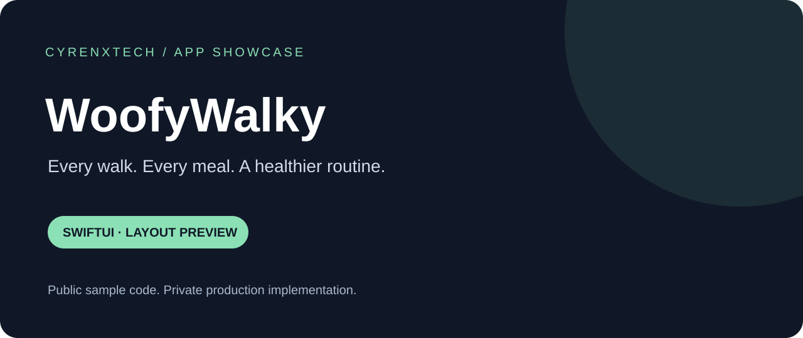

# WoofyWalky

**Every walk. Every meal. A healthier routine.**

An iPhone app concept bringing dog walks, meal logs, and health records into one daily routine.

[Explore the code](Sources/ContentView.swift) · [Run the demo](#run-the-layout-in-xcode) · [Project scope](docs/PROJECT_NOTES.md) · [Developer profile](https://github.com/infoammarai)

## App availability

**Not publicly available for download yet.** No verified App Store or public TestFlight link has been provided for this showcase. The source below is a developer preview, not an installable production app. This repository does not distribute an IPA or request payment.

## What you can explore

| Screen | Layout focus |
| --- | --- |
| Today | Daily routine, Walk progress, Meal journal |
| Walks | Start a walk, Recent activity, Explore parks |
| Health | Dog profile, Weight history, Care reminders |

The sample has working tab navigation and tappable cards that open a preview sheet. All copy is demonstration content. The banner is a portfolio graphic, not a screenshot of a running app.

## For clients and hiring teams

This repository is a small, readable example of SwiftUI interface work: reusable screen composition, local interaction state, SF Symbols, system typography, and adaptive cards. The sample uses no external packages, requires no API keys, and makes no network requests.

**Development approach:** Codex-assisted implementation with Xcode as the intended build and review environment. This is a new public sample; it is not an export of the production source or proof of a released app. Runtime validation is recorded in [project notes](docs/PROJECT_NOTES.md).

For freelance or role enquiries, visit [my GitHub profile](https://github.com/infoammarai). A preferred business contact and verified release links can be added when available.

## Run the layout in Xcode

1. Clone this repository: `git clone https://github.com/infoammarai/WoofyWalky-Showcase.git`.
2. In Xcode, create a new **iOS App** using **SwiftUI** and **Swift**. Set the deployment target to iOS 17 or later.
3. Keep Xcode's generated app entry point and replace its `ContentView.swift` with [Sources/ContentView.swift](Sources/ContentView.swift). Do not add a second copy of `ContentView`.
4. Select an installed compatible iPhone Simulator and run. Signing is only needed when running on a physical device.
5. Try all three tabs and tap a card to open and close its preview.

An Xcode project is not bundled; the sample is intentionally a single self-contained SwiftUI file.

## Public scope and privacy

The private native iOS implementation includes onboarding, walk tracking, meal-photo flows, dog profiles, and health-record screens. Those integrations are intentionally excluded from this public sample.

Only this layout sample and portfolio documentation are public. Production repositories and their Git histories remain private. No backend, account records, private assets, payment flows, credentials, analytics, or production algorithms are included.

## More app showcases

- [WoofyWalky](https://github.com/infoammarai/WoofyWalky-Showcase) — dog care routines
- [ABCTrade](https://github.com/infoammarai/ABCTrade-Showcase) — trading workspace concept
- [CyrenX](https://github.com/infoammarai/CyrenX-Showcase) — wellness concept

## Usage

Published for portfolio review. No open-source licence is granted at this time; contact the owner for reuse permission. Public visibility does not make the private product implementation available.
